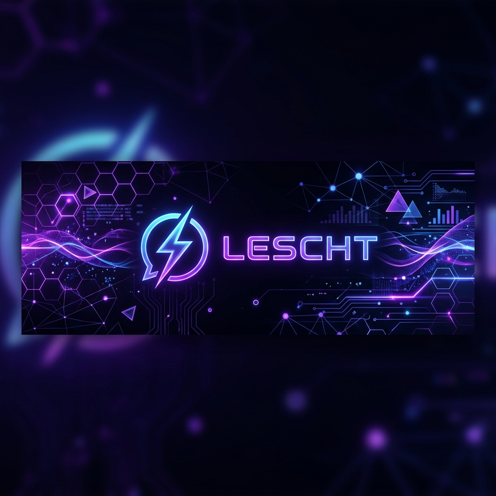

# ⚡ Lescht - Real-time Social Chat Platform



[](https://opensource.org/licenses/MIT)
[](https://nodejs.org/)
[](https://reactjs.org/)
[](https://socket.io/)

**Lescht** is a cutting-edge, full-stack real-time chat platform engineered for Gen Z and gaming communities. It bridges the gap between traditional direct messaging and community-driven Discord-style servers.

---

## 🚀 Key Features

### 🔐 Secure & Seamless Auth
- **JWT-Powered**: Robust authentication using Access and Refresh token rotation.
- **Session Recovery**: Instant session restoration with `/auth/me`.
- **Hashed Security**: Industry-standard password hashing with `bcrypt`.

### 💬 Rich Messaging Experience
- **Global Hub**: A central channel for everyone to connect.
- **Communities & Channels**: Organize conversations into focused servers and topical channels.
- **Private DMs**: Fast, secure 1:1 messaging.
- **Message History**: Persistent chat logs with optimized fetching.

### ⚡ Real-Time Interactions
- **Live Delivery**: Powered by Socket.IO for sub-millisecond message delivery.
- **Typing Indicators**: Know exactly when someone is responding (Global, Channel, & DM).
- **Presence Updates**: Real-time online/offline status tracking.
- **Smart Rooms**: Automatic socket management for seamless channel switching.

### 🏢 Community Management
- **One-Click Creation**: Launch your own community in seconds.
- **Invite Codes**: Secure and private community growth via unique join codes.
- **Intuitive UI**: Modern sidebar navigation for effortless multitasking.

---

## 🛠️ Tech Stack

| Frontend | Backend | DevOps/Tools |
| :--- | :--- | :--- |
| **React** & Vite | **Node.js** & Express | **npm Workspaces** |
| **Redux Toolkit** | **MongoDB** & Mongoose | **Concurrently** |
| **Tailwind CSS** | **Socket.IO** | **Nodemon** |
| **Axios** | **JSON Web Tokens** | **Helmet** & **CORS** |

---

## 📂 Project Structure

```text
Lescht/
├── client/                  # ⚛️ React frontend (Vite)
│   ├── src/
│   │   ├── components/chat/ # Main chat UI components
│   │   ├── pages/Auth/      # Authentication views
│   │   ├── redux/           # Global state management
│   │   ├── utils/axios.js   # API client with interceptors
│   │   └── socket.js        # Real-time client configuration
├── server/                  # 🟢 Node.js + Socket.IO backend
│   ├── config/              # Database & environment config
│   ├── controllers/         # Business logic & route handlers
│   ├── middleware/          # Security & JWT authorization
│   ├── models/              # Mongoose schemas (User, Message, Community)
│   ├── routes/              # RESTful API endpoints
│   ├── socket/              # WebSocket event orchestration
│   └── seed.js              # Database initialization script
├── prd.md                   # 📄 Product Requirements Document
└── package.json             # 📦 Root workspace configuration
```

---

## 🚦 Getting Started

### 📋 Prerequisites
- **Node.js**: v18 or higher
- **npm**: v9 or higher
- **MongoDB**: Local instance or MongoDB Atlas cluster

### ⚙️ Installation

1. **Clone the repository:**
   ```bash
   git clone https://github.com/mayankdoel/LesCht.git
   cd LesCht
   ```

2. **Install dependencies:**
   ```bash
   npm install
   ```

### 🔑 Environment Configuration

Create a `.env` file in the `server/` directory:
```env
MONGODB_URI=your_mongodb_connection_string
JWT_SECRET=your_access_token_secret
JWT_REFRESH_SECRET=your_refresh_token_secret
CLIENT_URL=http://localhost:5173
PORT=5000
```

### 🚀 Running the Platform

Launch both the frontend and backend with a single command from the root:
```bash
npm run dev
```

- **Frontend**: [http://localhost:5173](http://localhost:5173)
- **Backend API**: [http://localhost:5000](http://localhost:5000)
- **API Health**: [http://localhost:5000/api/health](http://localhost:5000/api/health)

---

## 🧪 Seed Data (Optional)

Populate your database with demo users, communities, and messages:
```bash
cd server
node seed.js
```
*Default password for demo users:* `password123`

---

## 🛣️ Roadmap

- [ ] **Threaded Conversations**: Reply directly to specific messages.
- [ ] **Advanced Moderation**: Role-based permissions and admin tools.
- [ ] **Horizontal Scaling**: Redis adapter integration for multi-instance support.
- [ ] **Social Login**: OAuth integration (Google, Discord, GitHub).
- [ ] **File Sharing**: Upload images and documents in chats.

---

## 🤝 Contributing

Contributions are welcome! Please feel free to submit a Pull Request.

---

## 👨‍💻 Author

**Mayank**

- GitHub: [@mayankdoel](https://github.com/mayankdoel)
- Website: [Your Portfolio/Linktree](https://github.com/mayankdoel)

---

## 📄 License

This project is licensed under the MIT License - see the [LICENSE](LICENSE) file for details.

---
<p align="center">Made with ❤️ for the gaming community</p>
